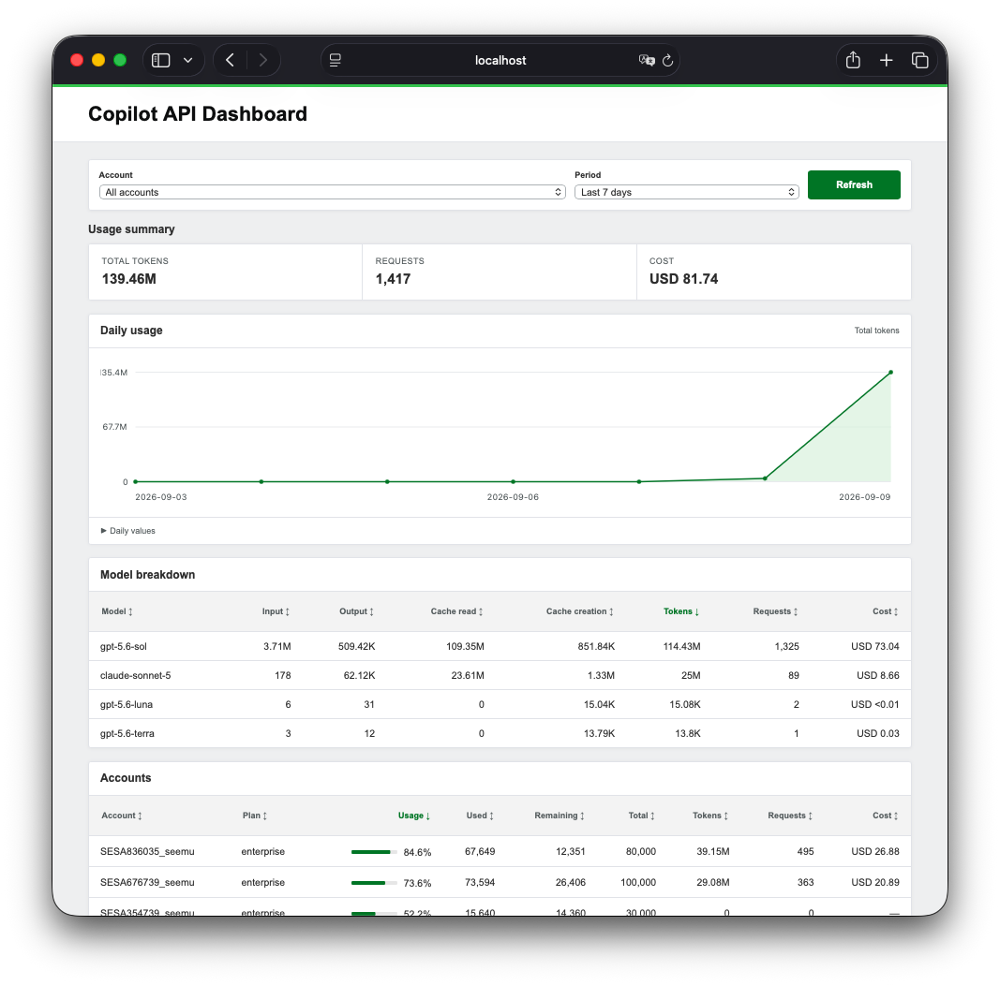

# Copilot API Dashboard

A usage dashboard for multiple [Copilot API](https://github.com/caozhiyuan/copilot-api) containers and accounts.

<p align="center">
  <a href="docs/images/dashboard-overview.png">
    
  </a>
</p>

## Features

- View quotas, tokens, requests, and costs across accounts
- Inspect daily usage, model breakdowns, and request events
- Discover running Copilot API containers through Docker
- Add endpoints manually with a YAML file
- Optionally store daily usage history in SQLite

## Quick start

The default setup discovers running containers that use the `ghcr.io/caozhiyuan/copilot-api:latest` image on the `service` Docker network.

Create the network if it does not exist, then start the dashboard:

```sh
docker network create service
docker compose up -d --build
```

Open <http://127.0.0.1:9000>.

Copilot API containers must join the same Docker network. To use another network, change `networks.copilot.name` in [`docker-compose.yml`](docker-compose.yml).

> The dashboard listens on localhost and has no built-in authentication. Use an authenticated reverse proxy before exposing it. Mounting the Docker socket gives the container elevated access, so deploy it only in a trusted environment.

## Configure endpoints

You can add endpoints that are not discovered through Docker:

```sh
cp config/endpoints.example.yaml config/endpoints.yaml
```

Each endpoint needs a name and URL. The URL may include a reverse proxy subpath. Credentials are optional:

```yaml
endpoints:
  - name: copilot-api-account-a
    url: http://copilot-api-account-a:4141
    api_key_env: COPILOT_API_ACCOUNT_A_KEY
```

Use `api_key_env` to read a credential from the dashboard environment. You can also use `api_key` to store it directly in YAML, but the file should then be protected and excluded from version control. Do not set both fields for one endpoint.

For Docker Compose, enable the endpoint file mount in `docker-compose.yml`. YAML endpoints take priority when a configured name or URL matches a discovered container.

Common settings:

| Environment variable                    | Default                                                                |
| --------------------------------------- | ---------------------------------------------------------------------- |
| `COPILOT_API_DASHBOARD_LISTEN_ADDR`     | `:9000`                                                                |
| `COPILOT_API_DASHBOARD_BASE_PATH`       | `/`                                                                    |
| `COPILOT_API_DASHBOARD_ENDPOINTS_FILE`  | `config/endpoints.yaml` if present, otherwise `/config/endpoints.yaml` |
| `COPILOT_API_DASHBOARD_DOCKER_IMAGE`    | `ghcr.io/caozhiyuan/copilot-api:latest`                                |
| `COPILOT_API_DASHBOARD_REQUEST_TIMEOUT` | `5s`                                                                   |
| `COPILOT_API_DASHBOARD_MAX_CONCURRENCY` | `32`                                                                   |
| `COPILOT_API_DASHBOARD_LOG_LEVEL`       | `info`                                                                 |

## Optional SQLite history

Persistence is disabled by default. When enabled, the dashboard stores daily usage in SQLite and syncs it at startup, at the configured interval, and when you click Refresh.

```yaml
environment:
  COPILOT_API_DASHBOARD_PERSISTENCE_ENABLED: "true"
  COPILOT_API_DASHBOARD_DATABASE_PATH: /data/dashboard.sqlite
  COPILOT_API_DASHBOARD_SYNC_INTERVAL: 10m
volumes:
  - ./data:/data
```

Quota details and request events are always read from Copilot API. The dashboard does not store API keys or request events. Use the same timezone for the dashboard and all Copilot API containers so daily boundaries match.

## Development

Go 1.26 or later is required. The frontend is embedded and has no additional dependencies.

```sh
make check
make run
```

Run the frontend tests with:

```sh
node --test web/app.test.cjs
```

## License

[MIT](LICENSE)
